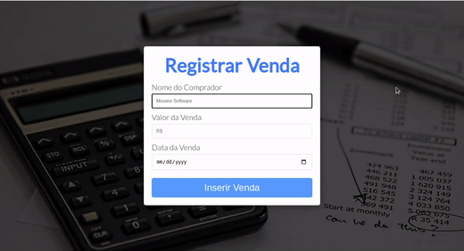

<h1 align="center" id="top">
  Registro de Vendas :receipt:
</h1>

<p align="center">
  
</p>

<div align="center">
  <a href="#problem">Problem
  |
  <a href="#expected">Expected Features
  |
  <a href="#solution">My Solution
</div>

## 🔧 Technologies

Esse projeto foi desenvolvido utilizando as seguintes tecnologias:

**- JavaScript**

**- HTML5** 

**- CSS3**

E está sendo hospedado por:

**- [Netlify](https://www.netlify.com/)**

## 💻 Getting Started

Você pode brincar o quanto quiser com o projeto. Basta clonar o repositório para sua máquina:

```bash
$ git clone https://github.com/Will-Andrade/teste-tecnico-movere-software.git && cd teste-tecnico-movere-software
```

## 📚 Project

Esse projeto foi desenvolvido como um teste para a vaga de Estágio na empresa [Movere Software](http://moveresoftware.com/).

<h2 id="problem">:thinking: The Problem</h2>

Um cliente precisa registrar as vendas realizadas para saber qual é o maior cliente dele.
Para isso ele pediu para a gente criar um cadastro onde ele irá registrar as vendas e uma forma de identificar a maior venda.

## :dart: Objective

O objetivo é criar uma aplicação em qualquer linguagem, plataforma e tecnologia que você esteja
familiarizado.
Pode ser no console, web, desktop, cliente-servidor e o ideal é que consigamos rodar sua aplicação.

<h2 id="expected">:toolbox: Expected Features</h2>

1. A aplicação deve permitir o usuário informar: nome do cliente, valor da venda, data da venda.
2. Ao clicar em um botão inserir, adicionar esses dados em uma grade para exibição, e salvar os dados
em um arquivo texto.
3. Ao carregar a aplicação já exibir os dados salvos anteriormente no arquivo texto.
4. Ter um botão "Maior venda", onde ao ser clicado irá exibir a venda de maior valor.

Fique à vontade para incluir novas funcionalidades, caso queira.

<h2 id="solution">:bulb: My Solution</h2>

1. Logo ao abrir a página, o usuário tem controle sobre um formulário com as informações necessárias para registar a venda.
  * Aqui há 3 inputs: Um para informar o nome do cliente, outro para informar o valor da venda e outro para a data da venda;
  * Caso todas as informações sejam fornecidas corretamente, a venda é registrada. 
  * Caso contrário, uma mensagem de erro é mostrada.

2. Após a venda ser registrada, ela ficará salva na tabela do usuário e terá pertinência de informações mesmo ao fechar a janela.

3. É possível obter o valor da maior venda realizada clicando no botão "Maior Venda".

4. Como funcionalidade extra, adicionei um botão que permite salvar a tabela de vendas diretamente no computador do usuário em formato CSV.

## 📖 Future to-dos

1. Deixar a aplicação responsiva.
2. Realizar um refactoring mais amplo com maior conhecimento acerca de single purpose functions.

<div align="center">
  <a href="#top">Back to top
</div>

<p align="center">Made with :heart: and Hard Work by <a href="https://github.com/Will-Andrade" target="_blank">Willian Andrade</a></p>
